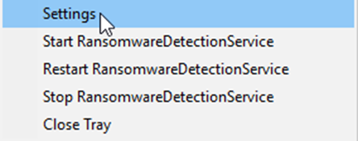
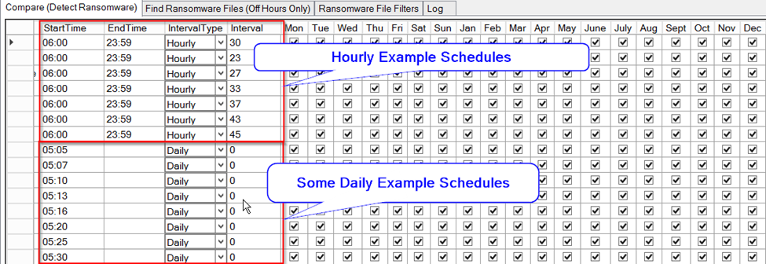
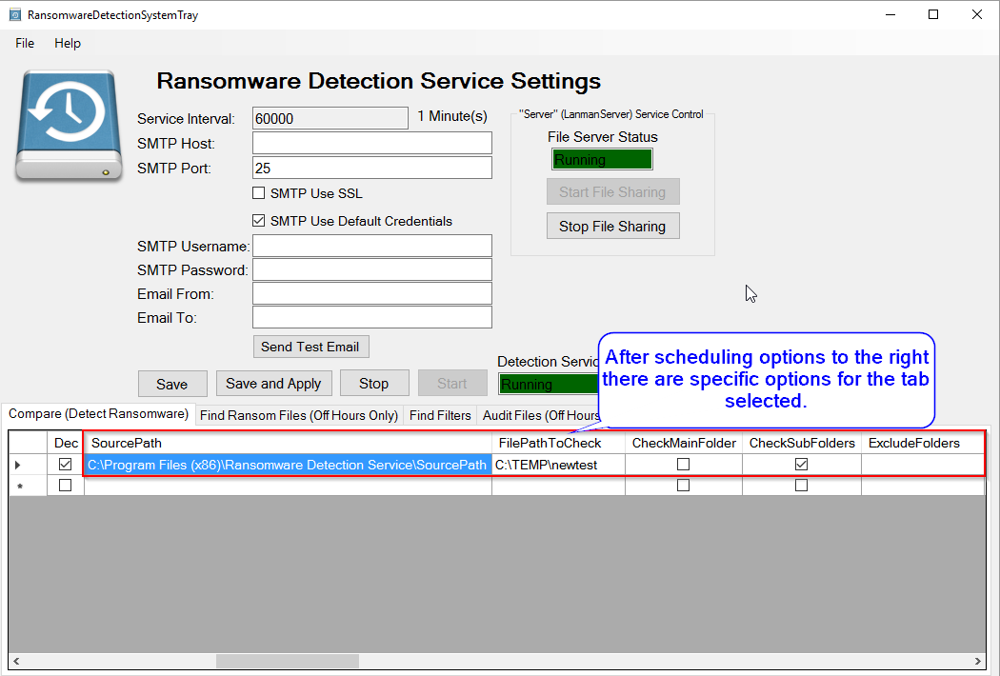
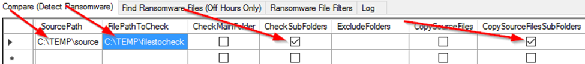
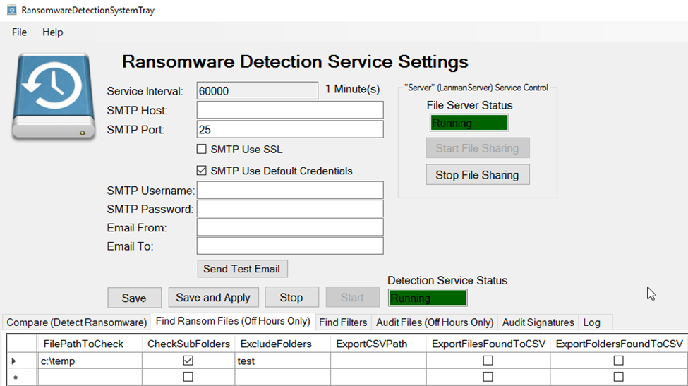
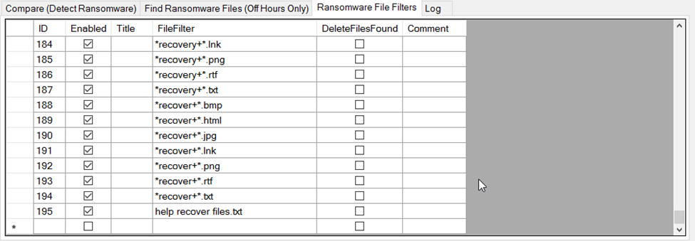

# Ransomware Detection Service

[RansomwareDetectionServiceDocumentation.pdf](Documentation_RansomwareDetectionServiceDocumentation.pdf)

This program detects all present and future ransomware in Windows file shares.

I made this service to monitor Windows file servers or NAS file shares. For early detection of ransomware you expect the ransomware to encrypt your sample files and you catch it in the act. This entraps ransomware because the sample files that ordinarily would be left alone become encrypted by the ransomware. **I made this program to aide system administrators monitor file servers.** I didn't make this for average users to monitor individual computers. 

**This program solves the following issues:**
* How do I monitor my windows file shares for ransomware with minimal performance impact?  (Compare tab and a few example files in the SourcePath)
* How do I detect a ransomware that does not create a ransom note in the file share or modify the file names in the share? (Compare tab)
* How do I automatically stop an infection from encrypting more files and only stop the user that was infected? (Compare tab - CommandProgram and the StopRansomwareInfectedUserPublic.ps1 script)
* What files and how many files are corrupted in my windows file shares? (Audit Files tab)
* How do I check the integrity of the files in file shares? (Audit Files tab)
* What files have been recently changed or created since that last good backup? (Audit Files tab, or Compare tab for full binary comparison)
* How do I detect encrypted or corrupted zip files, word documents, excel files, or powerpoint files?  (Audit Files tab - ValidateZipFiles option)
* What files and how many were repeatedly created by the virus? (Find Ransom Files tab)
* How do I delete the ransom note files created by the virus? (Find Ransom Files tab and Find Filters tab)
* How do I replace the corrupted files and keep the newest good files? (Audit Files tab)
* How do I quickly stop the Windows file server from sharing files during a virus outbreak? ("Stop File  Sharing" button)
* How do I restore files when long file paths are involved? (Audit Files tab, or FastCopy)
* How do I find out what files have file permissions corrupted or files that are inaccessible?  (Audit Files tab - ExportUnknownToCSV)
* What files were created or modified when compared to a previous backup?  (Audit Files tab or Compare tab for full comparison)

When staff members get ransomware, you need to respond quickly to get their computer shutdown as soon as possible.  If you respond quickly enough, you can shut down the offending computer before other file shares become encrypted.  Anti-virus programs currently do not detect encrypted files written by ransomware.  Not knowing that a ransomware virus is on your network is a big problem.  The sooner you get the offending computer shutdown and restore your backups of files shares the better.  

File servers do not get the virus, the virus encrypts the files stored on the file server. This makes knowing the damage caused by a ransomware difficult. If you do not notice an encrypted file share, you can lose your opportunity to restore from backup or cause your users to use a much older backup than necessary.  Anti-virus programs are always a few days behind in detecting new viruses.   

Find Ransomware Files tab helps determine damage caused by a previous uncaught infection.  I just added the ability to delete any ransomware created files for cleanup purposes after you restore your files from backup and determined which user caused the infection.  To get a listing of files that were encrypted when file extensions were changed or to find files created by ransomware use the Find Ransomware Files tab.

Audit Files tab will traverse a directory, compare file signatures for expected file extensions, and create a verified files list, unverified files list (possible corrupted/encrypted files), unknown files list, and prohibited files list.  This helps to determine the damage caused by a ransomware.  The lists will aide the restore of encrypted/corrupted files.  The FixUnverifiedFilesFromBackup option will fix corrupted files by replacing the bad files from the restored backup.

The worst case scenario is not noticing a ransomware infection, having to recover your file shares using an old backup, and keeping any new files saved in the file share since the infection.  The Audit Files tab will help you know the damage done to the file share and help the recovery process.  The only thing worse is not having a good backup at all, but the recovery process is not complicated in that scenario.

#### Caveat:
* Train or notify users to not delete the files/folders that are copied from the SourcePath.  Deleted files will cause a false positive missing files error message or email.
* Find Ransomware Files tab and Audit Files tab will be slow for large directories with many files.  Only run this during off hours.  Run Compare (Detection Ransomware) during business hours if you use small example source files.  Comparing a full backup vs your file share should be run off hours and make sure to turn off the command options.

## System Requirements
.Net 4.0 or newer is required.
Windows Server 2008 or newer
Windows 7 or newer
Both 32 and 64 bit operating systems are supported.

## Installation:
Download the zip file and extract installer Files (setup.exe and RansomwareDetectionServiceInstaller.msi) into the same directory and run setup.exe as administrator  Download link: [http://ransomwaredetectionservice.codeplex.com](http://ransomwaredetectionservice.codeplex.com)
Run the installation setup.exe downloaded from step 1 (Username for the service will be requested while installing the Windows service (username must to be in “Username@DOMAIN”, “DOMAIN\Username”, “Username@COMPUTERNAME”, “COMPUTERNAME\Username” format.)
 
If you specified the username correctly and clicked on OK, then the install will show success.  This domain username will need at least read access to the files shares you want to monitor.  The copy options require read/write access to the file share.

After install launch the system tray application then right click on it.   (You might have to click on the little arrow on the left of the system tray to show hidden system tray icons)

 

 You will see the following options (click on settings to display the main form for changing settings):
 

## Installation and Use Notes:
* I created the ability to detect ransomware in file shares using the Compare tab.
* The Find files tab is for getting a list of ransomware created ransom note files after an infection and to help delete the files.
* The Audit files tab audits your file share and determine what files are not encrypted, files that are new, and encrypted/corrupted files.  This tab validates file signatures and can test decompress zip files (.zip, .docx, .xlsx, .pptx, etc.)
* RansomwareDetectionService is a C# Windows service that will detect ransomware in a windows file share and optionally copy the files you want to verify to the SourcePath and the first layer of subfolders as well.  
* Run services.msc and change the logon username and password for "RansomwareDetectionService" to a user that has read/write permissions to the file shares you are working with.
* Make sure to use UNC paths for file shares or a local folder for the Windows Server running the service.
* Default sample files are stored in “C:\Program Files (x86)\Ransomware Detection Service\SourcePath”.  Change the folder name and files names stored inside this folder immediately after the first time installing the program.  It is preferable to delete the existing files and create your own sample files with different file names.  Add any new or different files types that you want to monitor.

## Overall Features:
* SourcePath files and folders are checked against the FilePathToCheck and if files are changed or missing then an error is logged and an email sent if SendEmailOnError is checked.
* Each row in the configuration table can run on a different schedule and have different options.
* Long path names are supported.
* Configuration table rows are executed via a multi-threaded call. Therefore, multiple folders can be scheduled to be checked and even run at the same time.

### Scheduling Options:
* Time Based or Interval Based Execution for each item in each configuration table.
* Day of the Week Selection via check box for Monday - Sunday
* Day of the Month Enter in day 1-31 desired and this will override Day of the Week
* Day of the Month Enter in -1 to -5 for NthDayOfTheWeek (where -1 is 1st day of the month and -5 is 5th day in the month) in conjunction with Day of the Week to select the desired WeekDay.
* Each configuration runs on a different thread so that they can run at the same time if needed and you don't see a file locking problem possible.
* StartDate:  Date to task needs to start executing.
* EndDate:  Date the task needs to stop executing.
#### Interval Type:
	* Hourly:  Enter start time in military time,  end time in military time, select hourly interval type,  and enter “interval” in minutes.
	* Daily:  Set a start time in military format,  select days and months you want to run and it will run at that time.
	* Monthly:  Set Interval to 1-31 to run on a specific day of the month,  specify -1 up to -5 and select a day to set the nth day of the month (e.g. -1 Mon would run on the 1st Monday of the month.) 

## Compare (Detect Ransomware) 

I created the ability to detect ransomware in file shares using the Compare tab.
RansomwareDetectionService is a C# Windows service that will detect ransomware in a windows file share and optionally copy the files you want to verify to the FilePathToCheck and the first layer of subfolders as well. 

SourceFiles: Source Folder with a few example files that will copy and compare later.  Make sure this path is not in a file share.

### Compare (Detect Ransomware in file share) Explanation and Overall Features:
The service will copy source files if missing into the FilePathToCheck and then on a schedule check to see if the source files have changed or went missing. First, create a folder in the SourcePath with a few small files with files of the type that you are concerned (XLS, XLSX, DOC, DOCX, PDF, JPG, PNG, TXT, etc.).  Copy this directory to each folder that you want to monitor or use CopySourceFiles or CopySourceFilesSubFolders options in order to copy the SourcePath files (only needs to run once with these options).  If these files change or get encrypted then you will receive an error in the error log and possibly an email if setup.  

SourceFiles: Source Folder with a few example files that will copy and compare later.  Make sure this path is not shared.
### Example Options (Entrapment):
Example Files for Comparison Later:

 
First level of immediate sub folders are compared but not the main folder, SourcePath folders and files are copied; If they go missing an error is logged/emailed and the files are copied again. FilePathToCheck should be a windows file share, but SourcePath should not be a file share.

The secondary purpose is to completely Audit a file share vs a full backup. This will compare files using binary differences and give you a list of changed files and files new since the backup that should be in the share. Set the backup path as the FilePathToCheck and the File Share to the SourcePath to do this. This process is slow and should only be run during off hours. The CSV files are saved in the ExportCSVPath. The new files will be in the Missing csv file because the backup won't have a copy of the new files. Review the missing files csv and verify that the files are good and not viruses or documents that deployed the virus. Viruses can wait a few days before encrypting files so running using a backup more than a week old is important.  For further auditing see the Audit Files tab.

### Compare Options:
* SourcePath:  Folder where files that will be used as the source for comparison (A file path that cannot be reached via a file share, and non-admin users do not have rights to modify are recommended.)  I recommend creating a few simple files with extensions you care to monitor.  These files will be copied to your FilePathToCheck Main folder for immediate sub folders and if these files are modified or the files are missing, then you can be notified of the problem.
* FilePathToCheck:  This is the file share that you want to monitor for ransomware or monitor the files for changes
* CheckMainFolder: Check the main FilePathToCheck to see if it has the SourcePath files exist in FilePathToCheck directory and are not changed.
* CheckSubFolders: Check the immediate sub folders of FilePathToCheck to see if it has the SourcePath files exist in each sub folder of the FilePathToCheck directory and are not changed.
* CopySourceFiles: Copies SourcePath files to FilePathToCheck is the files do not exist (This will make the “Files Missing” error only fire once.)
* CopySourceFilesSubFolders: Copies SourcePath files to each immediate sub folder of FilePathToCheck is the files do not exist.  (This will make the “Files Missing” error only fire once).  I recommend that you only run this option once and then turn off on subsequence runs.
* SendEmailOnFailure: Sends summary email when files are changed or if files are missing each time the directory is compared.
* SendEmailOnSuccess: Sends summary email notifying you that the file path was checked.
* ExcludedFolders:  Excludes list of folders separated by semicolon from the immediate sub folder check and immediate sub folder copy as well.
* ExportCSVPath: Path to where csv files will be saved. 
* ExportFilesDifferentToCSV: Export files changed to csv file. 
* ExportFilesMissingToCSV: Export files missing to csv file.
* ExecuteCommandOnDetectFileMissing: Executes CommandProgram if a file missing is detected.
* ExecuteCommandOnDetectFileDifferent: Executes CommandProgram if a file change is detected.
* ExecuteCommandOnDetectFolderMissing: Executes CommandProgram if a folder missing is detected.
* ExecuteCommandOnUserScopeOnly: Only executes the CommandProgram if a username is determined from the file changed in a home directory or file is missing in a home directory. The main home directory with usernames as sub folders must be the FilePathToCheck and CheckSubFolders must be true.
* CommandWorkingDirectory: The directory where the script or program will be located.
* CommandProgram: The program or batch command script to run (I created a sample powershell script to disable the computer account from the username with ransomware activity.  The script pulls the machines names from the associated user from Dell Kace. The script it called StopRansomwareInfectedComputerPublic.ps1.  This script will only work on home share monitoring not a share with multiple users creating and modifying files.)  I created another powershell script to disable the user account when ransomware activity is detected.  Example usage is below:
	* CommandWorkingDirectory:  Path to where this script is saved usually “C:\Program Files (x86)\Ransomware Detection Service”
	* CommandProgram: powershell.exe
	* CommandArguments: {"-ExecutionPolicy UNRESTRICTED -File "C:\Program Files (x86)\Ransomware Detection Service\StopRansomwareInfectedUserPublic.ps1 " -username [Username](Username)"}
* CommandArguments: {"Arguments for the program.  These place holders [Username](Username) will replace with the username found, [FullFilePath](FullFilePath) will replace with full file path of file changed, and [FullFolderPath](FullFolderPath) will replace parent folder full file path or FilePathToCheck."}
* CommandTimeout:  Timeout in minutes before the CommandProgram process will be killed.

## Find Ransomware Files  (Search for Ransomware created files)
The “Find Ransomware Files” tab searches all the specified directories for the ransomware file filters that you specify in the “Ransomware File Filters” tab.  

### Find Ransomware Files Options:
* FilePathToCheck:  This is the file share that you want to monitor for ransomware or monitor the files for changes
* CheckSubFolders: Recursively check all the sub folders of FilePathToCheck.
* ExportCSVPath: The path where the csv result files will be saved.
* ExportFilesFoundToCSV:  Export a list of ransomware related files found to a csv file.
* ExportFoldersFoundToCSV:  Export list of folders found to a csv file.
* ExportFilesDeletedToCSV:  Export list of files deleted to a csv file.
* ExportFileErrorToCSV:  Export file access/permission error list to a csv file.
* SendEmailOnFailure: Sends summary email when files are changed or if files are missing each time the directory is compared.
* SendEmailOnSuccess: Sends summary email notifying you that the file path was checked.
* ExcludedFolders:  Excludes list of folders separated by semicolon from FilePathToCheck. Any folder matching the exact name will be excluded.
* Ransomware File Filters (tab)
	* Enabled:   Search for this FileFilter
	* Title:  Name of ransomware to find or description of search
	* FileFilter:  Enter in file filter search expected by windows {(e.g. **recover**.txt, HELP_RESTORE_FILES.txt, or **.ecc)}
	* ExcludeFiles: Semicolon separated list of exact files names to exclude from results and delete. List false positive files found from a previous run of Find Files.
	* Delete Files Found: Delete all files found by the file filter.  (Only check mark this after you have verified the files you want to delete by a previous run and no false positives will be deleted.  Uncheck this after it has run once.  I recommend using a very specific file filter with this option.)
	* Comment: a comment regarding the file filter

### File Filters tab (More filters can be added at any time):

## Audit Files (Search for Ransomware Affected Files)
If a ransomware changes files in your windows file shares it is important to know the extent of the damage caused by the virus. The “Audit Files” tab will search specified directories and compare the file header/signature vs known file headers for the file extension.  The beginning of binary files are compared with known signatures to verify they are not encrypted.  This process does not work with text files or files where they are stored as text (HTML, XML, TXT etc).  If a compared file does not match the header it is outputted into the UnverifiedFiles.csv file.  If a file extension is not known or an error occurs then the file is outputted into the UnknownFiles.csv file.  Files that match the known file header/signature will output into the VerifiedFiles.csv file.   If a signature if flagged as prohibited then the file will be listed in the file ProhibitedFiles.csv file as well as the file VerifiedFiles.csv.  Custom file signatures can be added later in the Audit Signatures tab (This overrrides the stock signatures and all signatures have to be added). If the Audit Signatures table rows are deleted entirely then the stock signatures are used. Make sure and run the Audit prior to an infection to fix as many unknowns and unverified files as possible.  Text files do not have a file signature and will be listed with the unknown files.  

The FixUnverifiedFilesFromBackup option helps in the recovery process if you did not know about an infection and you have an old backup and recently saved files are still in the infected share.  Make sure to run the Audit with FixUnverifiedFilesFromBackup unchecked first to get a list of the files first and fix as many unknowns as possible.  Make backups and then give the FixUnverifiedFilesFromBackup option a try.

### Audit Files Options:
* FilePathToCheck:  This is the file share that you want to monitor for ransomware or monitor the files for changes
* CheckSubFolders: Recursively check all the sub folders of FilePathToCheck.
* ExcludedFolders:  Excludes list of folders separated by semicolon from FilePathToCheck. Any folder matching the exact name will be excluded.
* ExportCSVPath:  The path where the csv files will be saved (UnknownFiles.csv, UnVerifiedFiles.csv, and VerifiedFiles.csv)
* ValidateZipFiles:  Any file starting with zip file header will be test extracted to confirm that the file is not corrupted or encrypted. (zip, docx, xlsx, pptx, xps, oxps, epub, etc are all tested)
* ExportUnVerifiedToCSV: Saves unverified (Possible ransomware affected files) to csv file
* ExportVerifiedToCSV:  Saves file header verified list of files to csv file.  (Prohibited files will also be in this list if the signature matches the file extension)
* ExportUnknownToCSV:  Saves unknown (extension is unknown or error on reading the file) list of files to csv file.
* ExportProhibitedToCSV:  If any signatures and extensions are flagged as prohibited then they will be added to the prohibited csv file.
* ProhibitedFilesIgnoreFileExtension:  If a file signature is flagged as prohibited, then this option if checked will detect files even when file extension has been changed to hide the file.
* FixUnverifiedFilesFromBackup: Replace unverified files with files from restored backup. Make sure to run a full backup of FilePathToCheck folder before using this option. Run audit of FilePathToCheck folder with FixUnverifiedFilesFromBackup unchecked at least once and fix as many unknown files as possible to yield a better result. This makes the process of leaving good files alone and replacing corrupted/encrypted files with a backup file a lot easier. 
* RestoredFilesPath: If FixUnverifiedFilesFromBackup is checked then this is the Path to the restored backup of FilePathToCheck. These files must have the same folder structure as FilePathToCheck and will overwrite any unverified files. This handles the scenario where a ransomware was not detected for a while and good files were created after the ransomware hit the file share.  The backup will have the older files and files that were corrupted.  Only the corrupted files with a backup will need to be overwritten by the restored backup files.
* DetectDifferentFilesComparedWithBackup: Export files with different file sizes or different modified date or files missing when compared with restored backup path to a csv file.
* SendEmailOnFailure: Sends summary email of files that were possibly affected by ransomware.
* SendEmailOnSuccess: Sends summary email notifying you that the file path was audited.
* Audit Signatures tab  (If no signatures are listed then the stock signatures are used)
	* Enabled:  Whether signature check is enabled
	* ByteOffset:  Number of bytes to ignore previous to the Hexadecimal Pattern.
	* FirstNumberOfBytesToRead:  Number of bytes to read from the file to compare with the HexPattern.  (0 will default to 100 or HexPattern.Length + ByteOffset whichever is greater)
	* HexPattern:  The hexadecimal pattern to find within the first 100 bytes of a file.
	* SignaturesName:  The file type title or signature name
	* FileExtensions: a semicolon separated list of file extensions to match with the signatures include the period with each file extension e.g.   .doc;.docx;xls;xlsx
	* Prohibited:  If prohibited then any file with the extension and signature will be added to the prohibited list.  The file will also be listed in the verified list if signature hexadecimal pattern matches the file extension.
	* Comment:  A comment for the signature.

## Errors:
File Path Not Found:  Error indicates either not enough permissions to access the file/folder or the file/folder was deleted during traversal.

## Licensing
**Ransomware Detection Service BSD License:**
Copyright (c) 2016, pcooper – Ransomware Detection Service
[http://www.questiondriven.com](http://www.questiondriven.com)
All rights reserved.
Redistribution and use in source and binary forms, with or without modification, are permitted provided that the following conditions are met:
1. Redistributions of source code must retain the above copyright notice, this list of conditions and the following disclaimer.
2. Redistributions in binary form must reproduce the above copyright notice, this list of conditions and the following disclaimer in the documentation and/or other materials provided with the distribution.
3. Neither the name of the copyright holder nor the names of its contributors may be used to endorse or promote products derived from this software without specific prior written permission.
THIS SOFTWARE IS PROVIDED BY THE COPYRIGHT HOLDERS AND CONTRIBUTORS "AS IS" AND ANY EXPRESS OR IMPLIED WARRANTIES, INCLUDING, BUT NOT LIMITED TO, THE IMPLIED WARRANTIES OF MERCHANTABILITY AND FITNESS FOR A PARTICULAR PURPOSE ARE DISCLAIMED. IN NO EVENT SHALL THE COPYRIGHT HOLDER OR CONTRIBUTORS BE LIABLE FOR ANY DIRECT, INDIRECT, INCIDENTAL, SPECIAL, EXEMPLARY, OR CONSEQUENTIAL DAMAGES (INCLUDING, BUT NOT LIMITED TO, PROCUREMENT OF SUBSTITUTE GOODS OR SERVICES; LOSS OF USE, DATA, OR PROFITS; OR BUSINESS INTERRUPTION) HOWEVER CAUSED AND ON ANY THEORY OF LIABILITY, WHETHER IN CONTRACT, STRICT LIABILITY, OR TORT (INCLUDING NEGLIGENCE OR OTHERWISE) ARISING IN ANY WAY OUT OF THE USE OF THIS SOFTWARE, EVEN IF ADVISED OF THE POSSIBILITY OF SUCH DAMAGE.

**Delimon.Win32.IO Class License (Long Path File IO Support):**
Copyright © 2012, Johan Delimon
http://bit.ly/delimon 
All rights reserved.

Permission is hereby granted, free of charge, to any person obtaining a copy of this software and associated documentation files (the "Software"), to deal in the Software without restriction, including without limitation the rights to use, copy, modify, merge, publish, distribute, sublicense, and/or sell copies of the Software, and to permit persons to whom the Software is furnished to do so, subject to the following conditions:

The above copyright notice and this permission notice shall be included in all copies or substantial portions of the Software.

THE SOFTWARE IS PROVIDED "AS IS", WITHOUT WARRANTY OF ANY KIND, EXPRESS OR IMPLIED, INCLUDING BUT NOT LIMITED TO THE WARRANTIES OF MERCHANTABILITY, FITNESS FOR A PARTICULAR PURPOSE AND NONINFRINGEMENT.
IN NO EVENT SHALL THE AUTHORS OR COPYRIGHT HOLDERS BE LIABLE FOR ANY CLAIM, DAMAGES OR OTHER LIABILITY, WHETHER IN AN ACTION OF CONTRACT, TORT OR OTHERWISE, ARISING FROM, OUT OF OR IN CONNECTION WITH THE SOFTWARE OR THE USE OR OTHER DEALINGS IN THE SOFTWARE. 

**DotNetZip (Code Used to Verify Zip Files) License:**
Microsoft Public License (Ms-PL)

This license governs use of the accompanying software, the DotNetZip library ("the software"). If you use the software, you accept this license. If you do not accept the license, do not use the software.

1. Definitions

The terms "reproduce," "reproduction," "derivative works," and "distribution" have the same meaning here as under U.S. copyright law.

A "contribution" is the original software, or any additions or changes to the software.

A "contributor" is any person that distributes its contribution under this license.

"Licensed patents" are a contributor's patent claims that read directly on its contribution.

2. Grant of Rights

(A) Copyright Grant- Subject to the terms of this license, including the license conditions and limitations in section 3, each contributor grants you a non-exclusive, worldwide, royalty-free copyright license to reproduce its contribution, prepare derivative works of its contribution, and distribute its contribution or any derivative works that you create.

(B) Patent Grant- Subject to the terms of this license, including the license conditions and limitations in section 3, each contributor grants you a non-exclusive, worldwide, royalty-free license under its licensed patents to make, have made, use, sell, offer for sale, import, and/or otherwise dispose of its contribution in the software or derivative works of the contribution in the software.

3. Conditions and Limitations

(A) No Trademark License- This license does not grant you rights to use any contributors' name, logo, or trademarks.

(B) If you bring a patent claim against any contributor over patents that you claim are infringed by the software, your patent license from such contributor to the software ends automatically.

(C) If you distribute any portion of the software, you must retain all copyright, patent, trademark, and attribution notices that are present in the software.

(D) If you distribute any portion of the software in source code form, you may do so only under this license by including a complete copy of this license with your distribution. If you distribute any portion of the software in compiled or object code form, you may only do so under a license that complies with this license.

(E) The software is licensed "as-is." You bear the risk of using it. The contributors give no express warranties, guarantees or conditions. You may have additional consumer rights under your local laws which this license cannot change. To the extent permitted under your local laws, the contributors exclude the implied warranties of merchantability, fitness for a particular purpose and non-infringement.

 
  
 

  
**DotNetZip BZIP2 License:**

The managed BZIP2 code included in Ionic.BZip2.dll and Ionic.Zip.dll is
modified code, based on the bzip2 code in the Apache commons compress
library.

The original BZip2 was created by Julian Seward, and is licensed under
the BSD license.

The following license applies to the Apache code:
-----------------------------------------------------------------------

/*
 * Licensed to the Apache Software Foundation (ASF) under one
 * or more contributor license agreements.  See the NOTICE file
 * distributed with this work for additional information
 * regarding copyright ownership.  The ASF licenses this file
 * to you under the Apache License, Version 2.0 (the
 * "License"); you may not use this file except in compliance
 * with the License.  You may obtain a copy of the License at
 *
 * http://www.apache.org/licenses/LICENSE-2.0
 *
 * Unless required by applicable law or agreed to in writing,
 * software distributed under the License is distributed on an
 * "AS IS" BASIS, WITHOUT WARRANTIES OR CONDITIONS OF ANY
 * KIND, either express or implied.  See the License for the
 * specific language governing permissions and limitations
 * under the License.
 */ 
 
 
 

 
 
**DotNetZip ZLIB License:**
The following licenses govern use of the accompanying software, the
DotNetZip library ("the software"). If you use the software, you accept
these licenses. If you do not accept the license, do not use the software.

The managed ZLIB code included in Ionic.Zlib.dll and Ionic.Zip.dll is
modified code, based on jzlib.

The following notice applies to jzlib:
-----------------------------------------------------------------------

Copyright (c) 2000,2001,2002,2003 ymnk, JCraft,Inc. All rights reserved.

Redistribution and use in source and binary forms, with or without
modification, are permitted provided that the following conditions are met:

1. Redistributions of source code must retain the above copyright notice,
this list of conditions and the following disclaimer.

2. Redistributions in binary form must reproduce the above copyright
notice, this list of conditions and the following disclaimer in
the documentation and/or other materials provided with the distribution.

3. The names of the authors may not be used to endorse or promote products
derived from this software without specific prior written permission.

THIS SOFTWARE IS PROVIDED ``AS IS'' AND ANY EXPRESSED OR IMPLIED WARRANTIES,
INCLUDING, BUT NOT LIMITED TO, THE IMPLIED WARRANTIES OF MERCHANTABILITY AND
FITNESS FOR A PARTICULAR PURPOSE ARE DISCLAIMED. IN NO EVENT SHALL JCRAFT,
INC. OR ANY CONTRIBUTORS TO THIS SOFTWARE BE LIABLE FOR ANY DIRECT, INDIRECT,
INCIDENTAL, SPECIAL, EXEMPLARY, OR CONSEQUENTIAL DAMAGES (INCLUDING, BUT NOT
LIMITED TO, PROCUREMENT OF SUBSTITUTE GOODS OR SERVICES; LOSS OF USE, DATA,
OR PROFITS; OR BUSINESS INTERRUPTION) HOWEVER CAUSED AND ON ANY THEORY OF
LIABILITY, WHETHER IN CONTRACT, STRICT LIABILITY, OR TORT (INCLUDING
NEGLIGENCE OR OTHERWISE) ARISING IN ANY WAY OUT OF THE USE OF THIS SOFTWARE,
EVEN IF ADVISED OF THE POSSIBILITY OF SUCH DAMAGE.

-----------------------------------------------------------------------

jzlib is based on zlib-1.1.3.

The following notice applies to zlib:

-----------------------------------------------------------------------

Copyright (C) 1995-2004 Jean-loup Gailly and Mark Adler

  The ZLIB software is provided 'as-is', without any express or implied
  warranty.  In no event will the authors be held liable for any damages
  arising from the use of this software.

  Permission is granted to anyone to use this software for any purpose,
  including commercial applications, and to alter it and redistribute it
  freely, subject to the following restrictions:

  1. The origin of this software must not be misrepresented; you must not
     claim that you wrote the original software. If you use this software
     in a product, an acknowledgment in the product documentation would be
     appreciated but is not required.
  2. Altered source versions must be plainly marked as such, and must not be
     misrepresented as being the original software.
  3. This notice may not be removed or altered from any source distribution.

  Jean-loup Gailly jloup@gzip.org
  Mark Adler madler@alumni.caltech.edu

-----------------------------------------------------------------------

